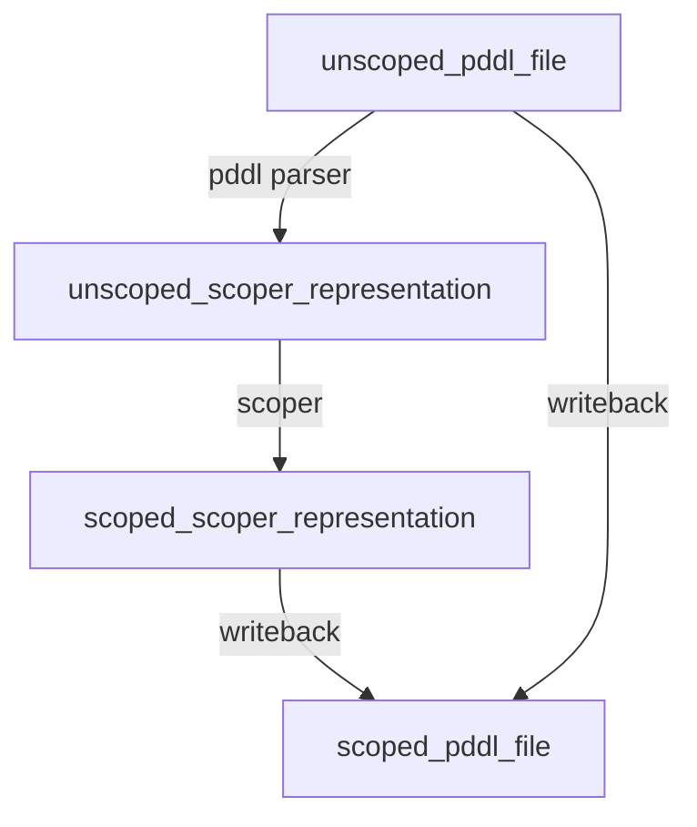
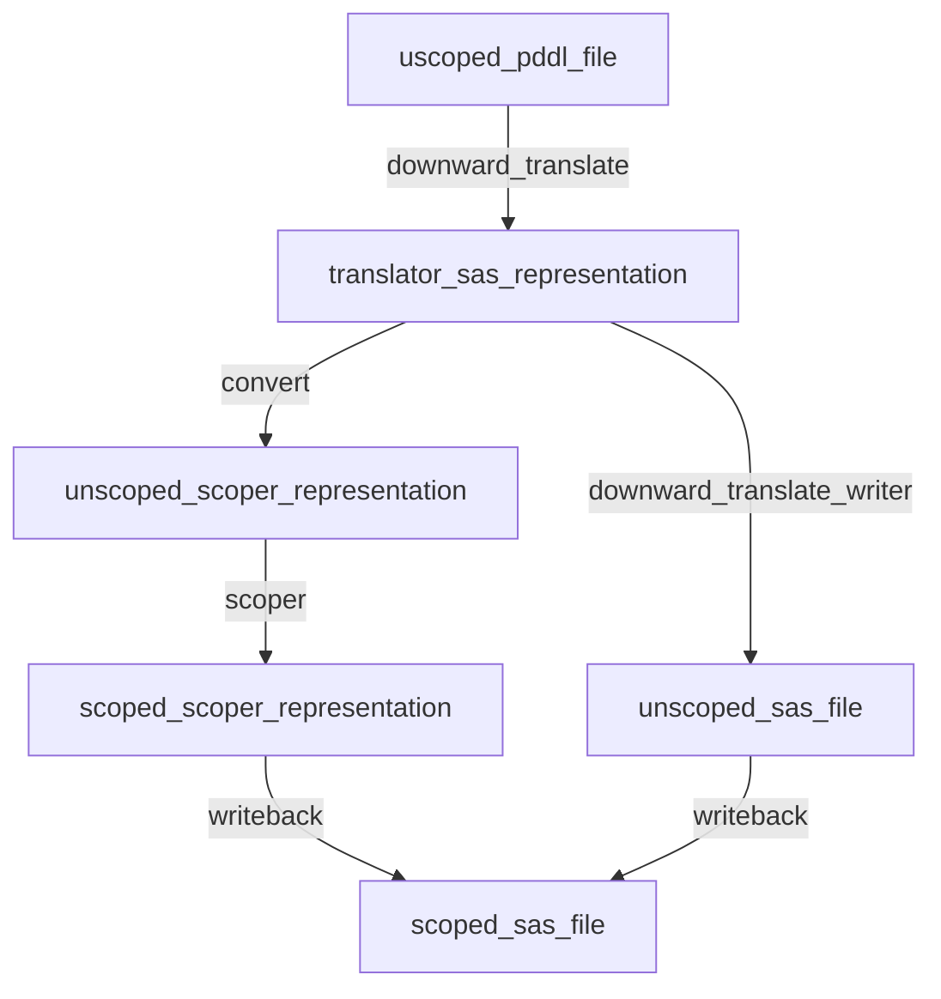
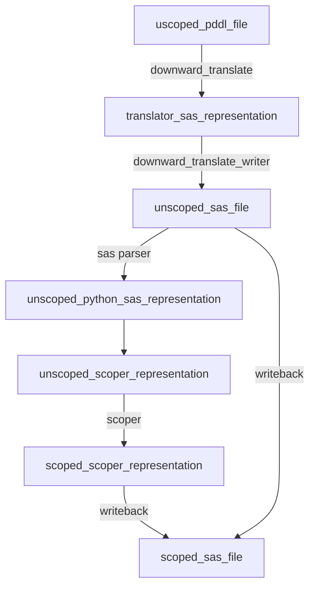
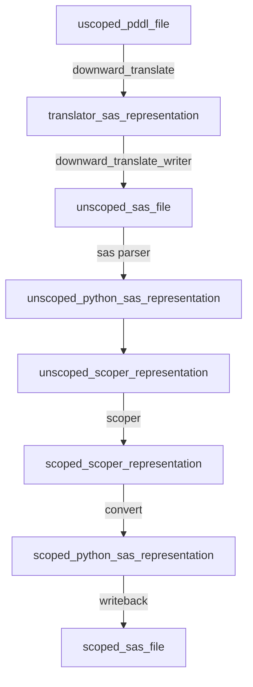

## Current PDDL Flow

```mermaid
graph TD;
unscoped_pddl_file --"pddl parser"--> unscoped_scoper_representation;
unscoped_scoper_representation --"scoper"-->scoped_scoper_representation;
scoped_scoper_representation --"writeback"-->scoped_pddl_file;
unscoped_pddl_file --"writeback"-->scoped_pddl_file;

```

## Current SAS Flow

```mermaid
graph TD;

uscoped_pddl_file --"downward_translate"-->translator_sas_representation;
translator_sas_representation--"downward_translate_writer"-->unscoped_sas_file;
translator_sas_representation--"convert"-->unscoped_scoper_representation;
unscoped_scoper_representation--"scoper"-->scoped_scoper_representation;
scoped_scoper_representation--"writeback"-->scoped_sas_file;
unscoped_sas_file--"writeback"-->scoped_sas_file;
```

## Planned SAS Flow 1

```mermaid
graph TD;
uscoped_pddl_file --"downward_translate"-->translator_sas_representation;
translator_sas_representation--"downward_translate_writer"-->unscoped_sas_file;
unscoped_sas_file--"sas parser"-->unscoped_python_sas_representation;
unscoped_python_sas_representation -->unscoped_scoper_representation;
unscoped_scoper_representation--"scoper"-->scoped_scoper_representation;
scoped_scoper_representation--"writeback"-->scoped_sas_file;
unscoped_sas_file--"writeback"-->scoped_sas_file;
```

## Planned SAS Flow 2

```mermaid
graph TD;
uscoped_pddl_file --"downward_translate"-->translator_sas_representation;
translator_sas_representation--"downward_translate_writer"-->unscoped_sas_file;
unscoped_sas_file--"sas parser"-->unscoped_python_sas_representation;
unscoped_python_sas_representation -->unscoped_scoper_representation;
unscoped_scoper_representation--"scoper"-->scoped_scoper_representation;
scoped_scoper_representation--"convert"-->scoped_python_sas_representation;
scoped_python_sas_representation--"writeback"-->scoped_sas_file;
```